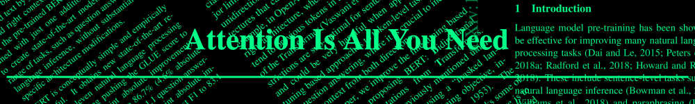

# Daily arXiv papers about efficiency

I'm interested in making deep learning more efficient.
I cover anything relevant to Transformers, LLMs, NLP, Optimization, etc.

arXiv categories covered:
[cs.AI](https://arxiv.org/list/cs.AI/recent)
[cs.CL](https://arxiv.org/list/cs.CL/recent)
[cs.ET](https://arxiv.org/list/cs.ET/recent)
[cs.LG](https://arxiv.org/list/cs.LG/recent)
[cs.NE](https://arxiv.org/list/cs.NE/recent)
[stat.ML](https://arxiv.org/list/stat.ML/recent)

Disclaimer: We're not affiliated with arXiv.

## June 2023

### 16

* [Neural Network Compression using Binarization and Few Full-Precision Weights](https://arxiv.org/pdf/2306.08960.pdf)
* [When and Why Momentum Accelerates SGD:An Empirical Study](https://arxiv.org/pdf/2306.09000.pdf)
* [Stochastic Re-weighted Gradient Descent via Distributionally Robust Optimization](https://arxiv.org/pdf/2306.09222.pdf)
* [PaReprop: Fast Parallelized Reversible Backpropagation](https://arxiv.org/pdf/2306.09342.pdf)
* [Sampling-Based Techniques for Training Deep Neural Networks with Limited Computational Resources: A Scalability Evaluation](https://arxiv.org/pdf/2306.09293.pdf)
* [MinMax Networks](https://arxiv.org/pdf/2306.09253.pdf)
* [Implicit Compressibility of Overparametrized Neural Networks Trained with Heavy-Tailed SGD](https://arxiv.org/pdf/2306.08125.pdf)
* [INT2.1: Towards Fine-Tunable Quantized Large Language Models with Error Correction through Low-Rank Adaptation](https://arxiv.org/pdf/2306.08162.pdf)
* [Contrastive Loss is All You Need to Recover Analogies as Parallel Lines](https://arxiv.org/pdf/2306.08221.pdf)
* [Accelerated Convergence of Nesterov's Momentum for Deep Neural Networks under Partial Strong Convexity](https://arxiv.org/pdf/2306.08109.pdf)
* [When to Use Efficient Self Attention? Profiling Text, Speech and Image Transformer Variants](https://arxiv.org/pdf/2306.08667.pdf)
* [MetaML: Automating Customizable Cross-Stage Design-Flow for Deep Learning Acceleration](https://arxiv.org/pdf/2306.08746.pdf)
* [Noise Stability Optimization for Flat Minima with Optimal Convergence Rates](https://arxiv.org/pdf/2306.08553.pdf)

### 15

* No new papers on arXiv

### 14

* [SqueezeLLM: Dense-and-Sparse Quantization](https://arxiv.org/pdf/2306.07629v1.pdf)
* [Exact Mean Square Linear Stability Analysis for SGD](https://arxiv.org/pdf/2306.07850v1.pdf)
* [One-for-All: Generalized LoRA for Parameter-Efficient Fine-tuning](https://arxiv.org/pdf/2306.07967v1.pdf)

### 13

* [Hidden symmetries of ReLU networks](https://arxiv.org/pdf/2306.06179v1.pdf)
* [$`FPDM`$: Domain-Specific Fast Pre-training Technique using Document-Level Metadata](https://arxiv.org/pdf/2306.06190v1.pdf)
* [Understanding the Effect of the Long Tail on Neural Network Compression](https://arxiv.org/pdf/2306.06238v1.pdf)
* [Improving Non-autoregressive Translation Quality with Pretrained Language Model, Embedding Distillation and Upsampling Strategy for CTC](https://arxiv.org/pdf/2306.06345v1.pdf)
* [Can Forward Gradient Match Backpropagation?](https://arxiv.org/pdf/2306.06968v1.pdf)
* [Unveiling the Hessian's Connection to the Decision Boundary](https://arxiv.org/pdf/2306.07104v1.pdf)
* [Benchmarking Neural Network Training Algorithms](https://arxiv.org/pdf/2306.07179v1.pdf)

### 12

* [Boosting with Tempered Exponential Measures](https://arxiv.org/pdf/2306.05487v1.pdf)
* [Reevaluating Loss Functions: Enhancing Robustness to Label Noise in Deep Learning Models](https://arxiv.org/pdf/2306.05497v1.pdf)
* [Asymptotically efficient one-step stochastic gradient descent](https://arxiv.org/pdf/2306.05896v1.pdf)
* [How Sparse Can We Prune A Deep Network: A Geometric Viewpoint](https://arxiv.org/pdf/2306.05857v1.pdf)
* [End-to-End Neural Network Compression via $`\frac{\ell_1}{\ell_2}`$ Regularized Latency Surrogates](https://arxiv.org/pdf/2306.05785v1.pdf)
* [Error Feedback Can Accurately Compress Preconditioners](https://arxiv.org/pdf/2306.06098v1.pdf)
* [Prodigy: An Expeditiously Adaptive Parameter-Free Learner](https://arxiv.org/pdf/2306.06101v1.pdf)
* [S$`^{3}`$: Increasing GPU Utilization during Generative Inference for Higher Throughput](https://arxiv.org/pdf/2306.06000v1.pdf)

### 11

* No new papers on arXiv

### 10

* No new papers on arXiv

### 9

* [Catapults in SGD: spikes in the training loss and their impact on generalization through feature learning](https://arxiv.org/pdf/2306.04815v1.pdf)
* [Mixture-of-Supernets: Improving Weight-Sharing Supernet Training with Architecture-Routed Mixture-of-Experts](https://arxiv.org/pdf/2306.04845v1.pdf)
* [Layer-level activation mechanism](https://arxiv.org/pdf/2306.04940v1.pdf)
* [Robust Learning with Progressive Data Expansion Against Spurious Correlation](https://arxiv.org/pdf/2306.04949v1.pdf)
* [Mixed-TD: Efficient Neural Network Accelerator with Layer-Specific Tensor Decomposition](https://arxiv.org/pdf/2306.05021v1.pdf)
* [Magnitude Attention-based Dynamic Pruning](https://arxiv.org/pdf/2306.05056v1.pdf)
* [Correlated Noise in Epoch-Based Stochastic Gradient Descent: Implications for Weight Variances](https://arxiv.org/pdf/2306.05300v1.pdf)
