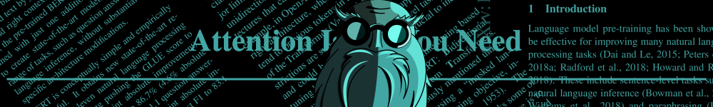

# Daily arXiv papers about efficiency

I'm interested in making deep learning more efficient.
I cover anything relevant to Transformers, LLMs, NLP, Optimization, etc.

arXiv categories covered:
[cs.AI](https://arxiv.org/list/cs.AI/recent)
[cs.CL](https://arxiv.org/list/cs.CL/recent)
[cs.ET](https://arxiv.org/list/cs.ET/recent)
[cs.LG](https://arxiv.org/list/cs.LG/recent)
[cs.NE](https://arxiv.org/list/cs.NE/recent)
[stat.ML](https://arxiv.org/list/stat.ML/recent)

🔥 New: I've added ChatGPT generated summaries. Click on them to reveal.
Feel free to submit PR if you can summarize them better.

Disclaimer: We're not affiliated with arXiv.

## June 24, 2023

No new papers on arXiv

## June 23, 2023

[Quantizable Transformers: Removing Outliers by Helping Attention Heads Do Nothing](https://arxiv.org/pdf/2306.12929.pdf) 

Summary

* Transformer models are widely used in various domains, but their large size requires significant compute and memory consumption.
* Quantization is an effective way to reduce computational time and memory usage, but strong outliers in activations make it difficult to quantize modern transformer models without sacrificing performance.
* The authors propose two modifications to the attention mechanism - clipped softmax and gated attention - that help address this issue by reducing outliers while maintaining or improving task performance, enabling full INT8 quantization without additional effort.

[Memory-Query Tradeoffs for Randomized Convex Optimization](https://arxiv.org/pdf/2306.12534.pdf) 

Summary

* The paper explores the tradeoffs between memory and query complexity in randomized convex optimization algorithms. It shows that achieving optimal performance in these algorithms requires either a significant amount of memory or a large number of queries.
* The authors introduce the concept of quasipolynomial precision, which refers to the level of accuracy or approximation achieved in the optimization problem. They demonstrate that achieving higher precision requires an exponential increase in either memory or query complexity.
* The paper also discusses the application of these tradeoffs to cutting plane methods, a type of randomized first-order algorithm. It provides insights into the optimal query complexity for convex optimization and highlights the challenges in balancing memory and query usage to achieve efficient and accurate solutions.

[Accelerated Training via Incrementally Growing Neural Networks using Variance Transfer and Learning Rate Adaptation](https://arxiv.org/pdf/2306.12700.pdf) 

Summary

* The paper introduces a novel approach to training neural networks called incrementally growing neural networks. This approach addresses the optimization difficulty caused by imbalanced training effort in subnetworks at different growth phases. It proposes a learning rate adaptation mechanism that rebalances the gradient contribution of these separate subcomponents.
* Experimental results demonstrate that the proposed method achieves comparable or better accuracy than training large fixed-size models. Additionally, it significantly reduces the computation budget required for training, resulting in real wall-clock training speedups. This highlights the efficiency and effectiveness of the proposed approach.
* The paper emphasizes the importance of considering the effects of network growth on training dynamics. By stabilizing weight, activation, and gradient scaling as the architecture evolves, the proposed parameterization scheme improves the overall training process. This contributes to improved accuracy and efficiency in training neural networks.

[Constant Memory Attention Block](https://arxiv.org/pdf/2306.12599.pdf) 

Summary

* The Constant Memory Attention Block (CMAB) is a novel attention mechanism that operates in constant memory and computation. It addresses the memory limitations of existing approaches, allowing for efficient processing of large-scale datasets without sacrificing performance.
* CMAB demonstrates its effectiveness in two domains: Neural Processes (NPs) and Temporal Point Processes (TPPs). In NPs, CMAB achieves competitive performance compared to prior state-of-the-art methods, such as TNP-D and LBANP. In TPPs, CMAB outperforms Transformer-based models (THPs) and offers the advantage of efficient model updates with new data.
* The paper highlights the importance of efficient attention mechanisms and discusses existing approaches to improve efficiency, such as linear complexity self-attention and intensity-free learning of temporal point processes. CMAB stands out by providing constant memory and computation requirements, making it a promising solution for low-compute domains.

[FFCV: Accelerating Training by Removing Data Bottlenecks](https://arxiv.org/pdf/2306.12517.pdf) 

Summary

* FFCV improves training efficiency: By implementing techniques such as efficient file storage, caching, and asynchronous data transfer, FFCV optimizes data loading and processing. This results in faster training times and improved overall efficiency.
* Competitive tradeoffs between accuracy and training time: FFCV allows users to achieve competitive tradeoffs between model accuracy and training time. The paper demonstrates this by training an ImageNet ResNet-50 model to 75% accuracy in just 20 minutes on a single machine, showcasing the effectiveness of FFCV in reducing training time.
* Performance, ease-of-use, and adaptability: The paper highlights the performance, ease-of-use, and adaptability of FFCV. It provides case studies and examples that demonstrate the effectiveness of FFCV in various scenarios, making it a valuable tool for researchers and practitioners in the field of machine learning.

[Don't be so Monotone: Relaxing Stochastic Line Search in Over-Parameterized Models](https://arxiv.org/pdf/2306.12747.pdf) 

Summary

* The paper proposes nonmonotone line search methods for Stochastic Gradient Descent (SGD) and Adam optimization algorithms in over-parameterized models.
* These nonmonotone methods allow for larger step sizes and faster convergence rates, even in non-convex landscapes.
* The authors introduce a new method called POlyak NOnmonotone Stochastic (PoNoS) that combines a nonmonotone line search with a Polyak initial step size and a resetting technique to reduce the number of backtracks, which improves the speed of convergence and generalization properties of SGD/Adam beyond previous monotonic line searches.

[Finite-time Lyapunov exponents of deep neural networks](https://arxiv.org/pdf/2306.12548.pdf) 

Summary

* The paper explores the finite-time Lyapunov exponents of deep neural networks and their impact on small input perturbations. It investigates the analogy between deep networks and dynamical systems, revealing the geometrical structures formed by these networks in input space.
* By understanding these structures, the paper aims to gain insights into the fundamental mechanisms underlying the learning capabilities of deep neural networks. It highlights the importance of these structures in shaping the behavior of the networks and their ability to generalize from training data to unseen examples.
* The findings of this study contribute to a deeper understanding of the inner workings of deep neural networks and provide valuable insights into their learning capabilities. This knowledge can potentially inform the development of more robust and efficient deep learning algorithms in various applications.

[Empirical Risk Minimization with Shuffled SGD: A Primal-Dual Perspective and Improved Bounds](https://arxiv.org/pdf/2306.12498.pdf) 

Summary

* This paper focuses on the topic of Empirical Risk Minimization with Shuffled SGD from a Primal-Dual Perspective and Improved Bounds.
* It explores the theoretical and practical aspects of stochastic gradient descent (SGD) in machine learning optimization methods, specifically examining the difference between sampling with replacement and sampling without replacement.
* The paper introduces the concept of the primal-dual perspective in the context of shuffled SGD, which helps improve the bounds and performance predictions of the optimization method.

[Verifying Global Neural Network Specifications using Hyperproperties](https://arxiv.org/pdf/2306.12495.pdf) 

Summary

* The paper presents a novel approach to neural network verification that focuses on global specifications, providing guarantees for all potential inputs.
* The authors introduce a hyperproperty formalism that allows for expressing global specifications such as monotonicity, Lipschitz continuity, global robustness, and dependency fairness.
* By leveraging capabilities for verifying general computational graphs, they extend the scope of guarantees that can be provided using existing methods, and highlight recent success in verifying specific global specifications.

## June 22, 2023

[Iterated Piecewise Affine (IPA) Approximation for Language Modeling](https://arxiv.org/pdf/2306.12317.pdf) 

Summary

* The paper introduces the IPA algorithm, which is a novel approach to language modeling using a first-order Taylor expansion and piecewise function estimation techniques.
* Experimental results show that IPA performs better than Transformers in predicting the next token for statistically common sequences, but Transformers may perform better for repeating an uncommon sequence seen earlier in the sequence.
* The authors suggest that future research could focus on addressing the issue observed in IPA and further exploring the potential applications of the IPA algorithm beyond language modeling.

[PriorBand: Practical Hyperparameter Optimization in the Age of Deep Learning](https://arxiv.org/pdf/2306.12370.pdf) 

Summary

* The paper introduces the PriorBand algorithm, which addresses the challenges of hyperparameter optimization (HPO) in deep learning. It leverages expert beliefs and cheap proxy tasks to guide the search for optimal hyperparameters, making the HPO process more efficient and effective.
* Leveraging cheap proxy tasks: The PriorBand algorithm is the first to develop an approach that utilizes cheap proxy tasks with an expert prior input. By incorporating these proxy tasks, the algorithm improves the optimization process beyond a naive solution, leading to better hyperparameter configurations.
* Efficiency and gains: The PriorBand algorithm has demonstrated its efficiency and gains in various deep learning benchmarks. It has shown improved performance compared to other HPO algorithms, achieving better results in terms of accuracy and convergence speed.

[Quantifying lottery tickets under label noise: accuracy, calibration, and complexity](https://arxiv.org/pdf/2306.12190.pdf) 

Summary

* The paper explores the concept of pruning deep neural networks and its impact on model accuracy. It provides empirical evidence that pruned models can achieve high accuracy even with a reduced number of parameters.
* The authors compare pruned models to full networks and find that pruned models can outperform or achieve similar accuracy levels while having significantly fewer parameters. This suggests that pruning can effectively reduce model complexity without sacrificing performance.
* The experimental analysis in the paper focuses on iterative magnitude pruning (IMP) and its ability to capture the true conditional probability distribution of labels. The results highlight the benefits of IMP in terms of accuracy and overconfident predictions, indicating its potential for practical applications in deep learning.

[Training Transformers with 4-bit Integers](https://arxiv.org/pdf/2306.11987.pdf) 

Summary

* Proposal of a Training Method: The paper introduces a novel training method for Transformers using INT4 arithmetic. This method allows for faster neural network training by carefully analyzing the structures of activations and gradients in Transformers and proposing dedicated quantizers for accurate quantization.
* Addressing Challenges: The authors address two specific challenges in training Transformers with 4-bit Integers. Firstly, they tackle the issue of outliers in forward propagation by employing a dynamic range estimator and a quantization-aware training strategy. Secondly, they handle the structural sparsity of gradients in backpropagation by introducing a gradient sparsification technique.
* Performance Improvements: The proposed algorithm achieves competitive accuracy on various tasks while providing significant speed improvements. The paper highlights that the algorithm can be implemented on current GPUs and offers a speedup compared to FP16 counterparts, making it an efficient solution for training Transformers with 4-bit Integers.

[No Wrong Turns: The Simple Geometry Of Neural Networks Optimization Paths](https://arxiv.org/pdf/2306.11922.pdf) 

Summary

* Theoretical Complexity of Neural Landscapes: The paper highlights that the observed optimization trajectories in neural networks contrast starkly with the theoretical complexity of neural landscapes. This suggests the potential for developing tailored theoretical results for deep learning or designing optimization algorithms that exploit the geometry of empirical objective functions. 
* Predictable Optimization Dynamics: The study reveals that optimization trajectories in neural networks exhibit predictable and consistent behavior throughout training. The findings indicate that these trajectories maintain stable dynamics and guarantee linear convergence. This insight provides valuable understanding of the optimization process in neural networks. 
* Empirical Learning Rate Schedules: The paper discusses how the observed properties of optimization trajectories relate to empirical learning rate schedules. While the specific details are not mentioned in the given texts, it suggests that the study explores the relationship between optimization dynamics and the choice of learning rate schedules in neural network training. 

[Deep Fusion: Efficient Network Training via Pre-trained Initializations](https://arxiv.org/pdf/2306.11903.pdf) 

Summary

* The paper introduces a technique called deep fusion, which combines multiple models into a single model to improve the training process of large models in natural language processing (NLP) tasks.
* Deep fusion reduces computational requirements and accelerates the training process, leading to improved generalization performance on various NLP tasks and different sizes of language models.
* The experiments and publications mentioned in the paper demonstrate that larger models tend to yield better performance in NLP tasks, and deep fusion offers a practical and effective approach to reduce training time and resource consumption while maintaining or surpassing traditional training methods.

[DynaQuant: Compressing Deep Learning Training Checkpoints via Dynamic Quantization](https://arxiv.org/pdf/2306.11800.pdf) 

Summary

* DynaQuant introduces a novel method for compressing model weights during training, optimizing storage and network bandwidth usage without sacrificing accuracy.
* The approach utilizes dynamic quantization, which categorizes model parameters into three groups based on their magnitude and sensitivity scores: pruning, protection, and quantization.
* The paper highlights the benefits of model checkpoint compression, such as reducing the size of checkpoints, enabling faster recovery from failures in training workloads, and improving overall efficiency in deep learning development workflows.

[Fantastic Weights and How to Find Them: Where to Prune in Dynamic Sparse Training](https://arxiv.org/pdf/2306.12230.pdf) 

Summary

* The paper explores the concept of Dynamic Sparse Training (DST) and its potential to optimize neural networks by adapting their topology during training.
* The authors investigate the influence of different pruning criteria on the dynamics of DST solutions and find that magnitude-based pruning often yields the best performance in low-density scenarios.
* Through extensive empirical analysis, the paper provides insights into the diverse weights selected for removal and highlights the importance of considering structural similarity in the pruning process.

## June 21, 2023

[A Simple and Effective Pruning Approach for Large Language Models](https://arxiv.org/pdf/2306.11695.pdf) 

Summary

* The paper introduces a novel pruning approach called Wanda for Large Language Models (LLMs). Wanda incorporates both weights and input activations to compute weight importance, and compares weights on a per-output basis instead of across the whole layer. This approach is found to be crucial for effective pruning of LLMs.
* Wanda outperforms magnitude pruning and competes favorably against recent methods that involve intensive weight update. It induces sparsity in pretrained LLMs without the need for retraining or weight update. This makes it a promising approach for optimizing large language models.
* The performance of Wanda is evaluated on various language benchmarks, and it is compared to established baseline methods. The results demonstrate the effectiveness of Wanda in inducing sparsity while maintaining or even improving the performance of LLMs on these benchmarks.

[Principles for Initialization and Architecture Selection in Graph Neural Networks with ReLU Activations](https://arxiv.org/pdf/2306.11668.pdf) 

Summary

* The paper focuses on the principles of initialization and architecture selection in Graph Neural Networks (GNNs) with ReLU activations. It introduces a residual GNN architecture called GCNII, which incorporates both FixUp-type skip connections and residual aggregation operators. Empirical results show that these models achieve strong performance on benchmark tasks like Cora.
* The paper presents theoretical results regarding the exponential output failure mode in GNNs and its connection to the exploding and vanishing gradient problem. It also provides precise statements of oversmoothing estimates in theorems, highlighting the importance of understanding the limitations of GNNs and the impact of depth and activation functions.
* The paper emphasizes the practical takeaways for initializing and designing GNNs. It highlights the significance of using residual connections to encourage trainability in deep GNNs and alleviate correlation collapse. The correct initialization, along with residual aggregation operators and connections, improves early training dynamics and enhances performance on various tasks.

[InRank: Incremental Low-Rank Learning](https://arxiv.org/pdf/2306.11250.pdf) 

Summary

* The paper introduces the theory of greedy low-rank learning (GLRL) which explains how deep learning implicitly regularizes neural networks towards low-rank solutions through a gradual increase of rank during training.
* However, GLRL requires an infinitesimal initialization of weights which is not practical, so the authors propose a new training algorithm called Incremental Low-Rank Learning (InRank) that explicitly expresses cumulative weight updates as low-rank matrices while incrementally augmenting their ranks during training to improve computational efficiency.
* InRank achieves comparable prediction performance as full-rank counterparts while requiring at most 33% of total ranks throughout training and has been demonstrated to be effective on various neural networks and standard algorithms such as transformers and SGD/Adam.

[Causal Effect Regularization: Automated Detection and Removal of Spurious Attributes](https://arxiv.org/pdf/2306.11072.pdf) 

Summary

* This paper introduces the concept of causal effect regularization as a method to detect and remove spurious attributes in classification datasets. It proposes a novel approach that can identify and mitigate the classifier's reliance on these attributes, even when information about them is unavailable.
* The authors highlight the limitations of existing methods for identifying spurious attributes and demonstrate how their proposed method overcomes these limitations. By leveraging the ranking of the causal effect of causal and spurious attributes, they show that there exists a regularization strength that can lead to a desired classifier with lower loss compared to the undesired classifier.
* The proposed method shows promising results in various real-world datasets, outperforming previous methods in reducing the dependence of classifiers on spurious attributes. This suggests its potential for practical applications in automated detection and removal of spurious attributes, improving the accuracy and reliability of classification models.

[Agnostically Learning Single-Index Models using Omnipredictors](https://arxiv.org/pdf/2306.10615.pdf) 

Summary

* The paper introduces a novel approach for agnostically learning Single-Index Models (SIMs) with arbitrary monotone and Lipschitz activations. This is significant because it eliminates the need for prior knowledge of the activation function and only assumes bounded second moments for the marginal.
* The authors propose an algorithm based on recent research on omniprediction using predictors satisfying calibrated multiaccuracy. This algorithm efficiently computes an ε1-calibrated and (C, ε1)-multiaccurate predictor, where calibration and multiaccuracy are defined in the context of fairness literature.
* The paper provides a proof of Theorem 3.2, which combines the results from previous theorems and lemmas. The proof demonstrates the effectiveness of the proposed algorithm in learning SIMs and establishes its theoretical foundations.

[Adaptive Strategies in Non-convex Optimization](https://arxiv.org/pdf/2306.10278.pdf) 

Summary

* The first problem in optimizing deep learning models is the effect of noise on the convergence rate of stochastic optimization algorithms, which can be addressed by designing noise-adaptive algorithms that can automatically achieve optimal rates under different noise scales.
* The second problem is the wide range of gradient magnitudes in deep neural networks, which can be mitigated by using scale-free algorithms that adapt to the gradient scales.
* The third problem is the relaxed smoothness condition of some deep learning objective functions, which can be addressed by using a generalized SignSGD algorithm that can theoretically match the best-known convergence rates without explicit gradient clipping and can adapt to the unknown relaxed smoothness.

[Magnificent Minified Models](https://arxiv.org/pdf/2306.10177.pdf) 

Summary

* The paper explores different methods for compressing large neural networks while maintaining model accuracy, including parameter and neuron selection, quantization, and training smaller models from scratch.
* The OBD-SD method slightly outperformed all other parameter and neuron selection methods in the experiments with substantial pruning.
* The results are only barely consistent with the Lottery Ticket Hypothesis, and the paper provides valuable insights into optimizing deep neural networks.

[Mean-field Analysis of Generalization Errors](https://arxiv.org/pdf/2306.11623.pdf) 

Summary

* The paper introduces a novel framework for analyzing generalization errors in machine learning algorithms. It utilizes differential calculus on the space of probability measures to explore weak and L2 generalization errors.
* The authors establish conditions under which the generalization error convergence rate, when training on a sample of size n, is O(1/n). This result provides insights into the relationship between the sample size and the generalization performance of the algorithm.
* The paper compares this framework for analyzing generalization errors in overparameterized regimes to existing theories for under-parameterized regimes. It highlights the three main approaches used in analyzing learning problems in an overparameterized regime: the neural tangent kernel (NTK), random feature, and mean-field approaches.

[A Passivity-Based Method for Accelerated Convex Optimisation](https://arxiv.org/pdf/2306.11474.pdf) 

Summary

* The paper introduces a passivity-based methodology for designing accelerated convex optimization algorithms in the continuous-time domain. This methodology combines the concepts of passivity from control theory and time-dependent change of variables to create a general framework for generating convex optimization algorithms with different convergence rate bounds on the objective function value.
* The authors highlight the role of dissipativity theory in the analysis and design of optimization algorithms. By constructing associated Lyapunov functions, they enable rigorous convergence analysis and provide a deeper understanding of the relationship between control theory and optimization.
* The proposed methodology offers a constructive procedure for achieving accelerated convergence in the design of new optimization algorithms. It provides a streamlined approach for designing and analyzing accelerated convex optimization algorithms, allowing for improved efficiency and performance in various applications.

[Dropout Regularization Versus $`\ell_2`$-Penalization in the Linear Model](https://arxiv.org/pdf/2306.10529.pdf) 

Summary

* The paper investigates the statistical behavior of gradient descent iterates with dropout in the linear regression model.
* The authors compare the performance of dropout regularization and ℓ2-penalization in preventing overfitting in neural networks.
* The paper provides non-asymptotic bounds for expectations and covariance matrices of the iterates derived in this study.

[Traversing Between Modes in Function Space for Fast Ensembling](https://arxiv.org/pdf/2306.11304.pdf) 

Summary

* The paper introduces a novel framework called "bridge networks" that aims to reduce the inference costs of deep neural networks. These bridge networks efficiently predict outputs for low-loss subspaces without the need for multiple forward passes through the original network.
* Through empirical validation on various image classification benchmarks, the paper demonstrates that bridge networks can accurately predict outputs of connecting subspaces with minimal computation cost. This means that the proposed framework can significantly reduce inference costs without sacrificing performance.
* The paper also discusses the problem setup of K-way classification with D-dimensional inputs and presents the decomposition of a deep neural network into a feature extractor and a classifier. Additionally, the paper highlights the importance of mode connectivity in ensembling methods and how bridge networks leverage this connectivity to make accurate predictions.

[ZeRO++: Extremely Efficient Collective Communication for Giant Model Training](https://arxiv.org/pdf/2306.10209.pdf) 

Summary

* ZeRO++ is an efficient collective communication solution for giant model training using ZeRO stage-3. It optimizes both model weights and gradients communication in the forward and backward pass of each training iteration.
* ZeRO++ employs three techniques to reduce communication volume: block-based quantization and data pre-fetching to reduce communication volume of model weights in forward propagation, holding secondary model partition on each node to remove cross-node communication of weights during the backward pass, and a straightforward interleaving schedule to merge the convergence gap.
* The implementation of ZeRO++ results in significant improvements in training throughput at scale. It achieves up to 2.16x better throughput at 384 GPU scale, enabling faster training of large language models.

[Spatial-SpinDrop: Spatial Dropout-based Binary Bayesian Neural Network with Spintronics Implementation](https://arxiv.org/pdf/2306.10185.pdf) 

Summary

* Utilizing Dropout as an approximation of the posterior distribution in BayNNs: The paper highlights the benefits of using Dropout as an approximation of the posterior distribution in Bayesian neural networks (BayNNs). Dropout helps in estimating uncertainty in deep learning models, enhancing the trustworthiness of decision-making, and providing insight into the model's confidence in its predictions.
* Spintronics-based computation-in-memory (CiM) hardware arrays for edge AI: The paper discusses the implementation of BayNNs in spintronics-based computation-in-memory (CiM) hardware arrays. This approach offers a viable solution for edge AI by leveraging the fast switching, high endurance, and CMOS compatibility of MRAM (Magnetic Random Access Memory) devices. The main component of MRAM devices is the Magnetic Tunnel Junction (MTJ), which allows for efficient and energy-saving computation.
* Addressing challenges in hardware Dropout modules for CNN topologies: The paper addresses the challenges that arise when designing hardware Dropout modules for convolutional neural network (CNN) topologies. It introduces MC-SpatialDropout, a spatial dropout-based approximate BayNNs with spintronics implementation, which aims to overcome these challenges. MC-SpatialDropout provides a solution for efficient uncertainty estimation in CNNs, enhancing the performance and reliability of edge AI systems.

[LoSparse: Structured Compression of Large Language Models based on Low-Rank and Sparse Approximation](https://arxiv.org/pdf/2306.11222.pdf) 

Summary

* LoSparse is a model compression technique for large language models based on low-rank and sparse approximation.
* The method combines the advantages of low-rank approximations and pruning to reduce the size and complexity of transformer models while maintaining their performance in natural language tasks.
* LoSparse achieves superior results compared to existing compression methods and has been evaluated on various language tasks.

[Sparse Modular Activation for Efficient Sequence Modeling](https://arxiv.org/pdf/2306.11197.pdf) 

Summary

* Sparse Modular Activation (SMA) is a new mechanism that enables neural networks to sparsely and dynamically activate sub-modules for sequence elements, reducing computation and memory consumption in sequence modeling tasks.
* SMA outperforms traditional self-attention-based models in terms of quality-efficiency trade-offs, achieving state-of-the-art results on several benchmark datasets while using fewer parameters and less computation.
* The SeqBoat architecture utilizes SMA to activate a Gated Attention Unit (GAU) based on the state representations learned from a Linear State Space Model (SSM), achieving even better performance on certain tasks. However, the scalability and applicability of SMA to larger, more complex models remain uncertain, and ethical considerations such as data privacy need to be seriously considered.

[The Implicit Bias of Batch Normalization in Linear Models and Two-layer Linear Convolutional Neural Networks](https://arxiv.org/pdf/2306.11680.pdf) 

Summary

* The paper focuses on studying the implicit bias of batch normalization in linear models and two-layer linear convolutional neural networks. It explores the convergence rate, theoretical understanding, and the impact of batch normalization on these models.
* The authors introduce key proof techniques to analyze the implicit bias of batch normalization. They discuss the training process happening in a subspace and the use of a projection matrix in their results.
* The paper presents theoretical results and proofs, including the proof of the first result. It provides insights into the convergence rate, implicit bias, and the theoretical understanding of batch normalization in linear models and two-layer linear convolutional neural networks.

[Understanding Generalization in the Interpolation Regime using the Rate Function](https://arxiv.org/pdf/2306.10947.pdf) 

Summary

* Characterizing smoothness: The paper introduces a new approach to characterize the smoothness of a model. Unlike traditional methods, this approach focuses on the rate function, which provides insights into the behavior of the model in the interpolation regime.
* Biasing towards smoother interpolators: The paper discusses modern learning techniques that bias the optimizer towards smoother interpolators. By understanding the impact of smoothness on generalization, these techniques aim to improve the performance of machine learning models.
* Contribution to understanding generalization error: The theoretical analysis presented in this paper contributes to our understanding of generalization error in machine learning. By examining the relationship between smoothness and generalization, it provides valuable insights into why some interpolators generalize better than others.

[AdaSelection: Accelerating Deep Learning Training through Data Subsampling](https://arxiv.org/pdf/2306.10728.pdf) 

Summary

* Flexible combination of baseline methods: AdaSelection allows for the integration of various baseline sub-sampling methods, such as uniform, Big Loss, Small Loss, Gradient Norm, AdaBoost, and Coresets selection. This flexibility enables the selection of the most informative sub-samples within each minibatch.
* Maintaining model performance: Despite subsampling, AdaSelection ensures that model performance is not compromised. By carefully selecting the most representative sub-samples, AdaSelection maintains accuracy while significantly reducing training time for large-scale deep learning models.
* Improved selection during forward and backward passes: AdaSelection improves the selection of data instances during both forward and backward passes. It leverages a mixture policy that selects sub-samples with the biggest and smallest losses, as well as finding datapoints closest to the mean loss of the whole batch. This approach ensures that the selected sub-samples are informative and representative of the entire dataset.

[Instant Soup: Cheap Pruning Ensembles in A Single Pass Can Draw Lottery Tickets from Large Models](https://arxiv.org/pdf/2306.10460.pdf) 

Summary

* Instant Soup Pruning (ISP): The paper proposes ISP as a novel pruning strategy that integrates the "model soup" idea. It replaces expensive intermediate pruning stages with computationally-cheap weak mask generation and denoising, while outperforming traditional pruning methods for large pre-trained models.
* Self-denoising ability: ISP naturally provides a "self-denoising" ability, eliminating the need for generating high-quality and expensive masks at each pruning stage. Instead, it generates multiple computationally inexpensive weak masks and averages them out to reduce solution noise, improving the overall performance.
* Dense-to-dense paradigm and Instant Model Soup: ISP can be adapted to the dense-to-dense paradigm, known as Instant Model Soup, to inject the benefits of model soups in dense pre-trained models at marginal training cost. This improves fine-tuning performance and offers potential advantages for various applications.

[Optimizer's Information Criterion: Dissecting and Correcting Bias in Data-Driven Optimization](https://arxiv.org/pdf/2306.10081.pdf) 

Summary

* The paper discusses the Optimizer's Information Criterion and its role in addressing bias in data-driven optimization.
* The criterion eliminates the need for computationally expensive techniques like cross-validation and can be used for decision selection in addition to model selection.
* The paper also explores the application of the criterion to various data-driven optimization formulations.

[Convergence and concentration properties of constant step-size SGD through Markov chains](https://arxiv.org/pdf/2306.11497.pdf) 

Summary

* This paper analyzes the convergence and concentration properties of constant step-size stochastic gradient descent (SGD) through Markov chains.
* The paper presents non-asymptotic results on the convergence of SGD to an invariant distribution in total variation distance and Wasserstein distance.
* The analysis includes discussions on the assumptions necessary for SGD convergence, the relationship between the gradient and concentration properties, and the applications of these results in deriving high-confidence bounds for the final estimate.

[P-tensors: a General Formalism for Constructing Higher Order Message Passing Networks](https://arxiv.org/pdf/2306.10767.pdf) 

Summary

* The paper introduces the concept of P-tensors, which are permutation equivariant tensors used to construct higher order message passing networks.
* The proposed paradigm of using P-tensors and higher order message passing networks achieves state-of-the-art performance on various benchmark datasets, particularly on highly structured graphs like molecules.
* The authors suggest that further exploration is needed to determine the best subgraphs to use in constructing P-tensors and to understand the spatial layout of these higher order representations.

[Beyond Geometry: Comparing the Temporal Structure of Computation in Neural Circuits with Dynamical Similarity Analysis](https://arxiv.org/pdf/2306.10168.pdf) 

Summary

* The paper introduces a novel similarity metric that allows for the comparison of neural networks based on their dynamics, rather than just their spatial geometry. This metric incorporates data-driven dynamical systems theory and Procrustes Analysis to effectively identify and distinguish dynamic structures in recurrent neural networks.
* The authors demonstrate the effectiveness of their proposed method through four case studies. These case studies involve comparing the dynamics of neural networks trained on different tasks, such as the well-known 3-bit Flip Flop task. The results show that the proposed similarity metric successfully captures the core features of the original nonlinear dynamics in these networks.
* The findings of this study have implications for understanding the variability in neural activity and behavior across subjects performing flexible decision-making tasks. By jointly explaining behavioral and neural variability, this framework provides insights into the underlying mechanisms of decision-making processes.

[Memory-Constrained Algorithms for Convex Optimization via Recursive Cutting-Planes](https://arxiv.org/pdf/2306.10096.pdf) 

Summary

* The paper proposes a family of recursive cutting-plane algorithms that can solve feasibility problems with constrained memory.
* These algorithms provide a positive trade-off between gradient descent and cutting-plane methods, making them valuable tools in various optimization scenarios.
* The paper also includes a convergence proof for the memory-constrained gradient descent for feasibility problems and describes how to improve the known lower-bound trade-offs.

[Intrinsic Dimension Estimation for Robust Detection of AI-Generated Texts](https://arxiv.org/pdf/2306.04723.pdf) 

Summary

* The increasing quality of AI-generated content poses a challenge for distinguishing between human and AI-generated texts.
* The paper proposes an invariant measure, the intrinsic dimensionality of the manifold underlying text embeddings, which can effectively separate natural and AI-generated texts.
* The paper provides insights into the average intrinsic dimensionality for different languages and highlights the statistical differences between human-generated and AI-generated texts.

## June 20, 2023

No new papers on arXiv

## June 19, 2023

[Inverse Scaling: When Bigger Isn't Better](https://arxiv.org/pdf/2306.09479.pdf) 

Summary

* The paper explores the concept of inverse scaling in language models, which refers to a phenomenon where larger models initially outperform smaller models on a given task, but then experience a decline in performance before eventually improving again at even larger scales.
* The authors provide empirical evidence for inverse scaling by analyzing the performance of language models on different tasks. They observe that smaller models perform randomly, larger models confidently predict incorrect answers, and propose the existence of a third stage where models become capable enough to perform the task accurately.
* The paper identifies four potential causes of inverse scaling: insufficient model capacity, overfitting to the training data, limitations in the training process, and the presence of adversarial examples. These factors contribute to the complex behavior observed in language models and highlight the need for further investigation.

[Understanding Parameter Sharing in Transformers](https://arxiv.org/pdf/2306.09380.pdf) 

Summary

* Parameter sharing approach: The paper explores the parameter sharing approach in Transformers, which helps the model learn more efficiently with limited parameters. It discusses the success of this approach, which depends on optimized training convergence and a small part on increased model complexity.
* Model complexity and performance: The experiments conducted on 8 WMT machine translation tasks show that the original Transformer model, without parameter sharing, can achieve competitive performance against the sharing model, but with only half the model complexity. This suggests that the original Transformer model still has room for improvement and serves as a strong baseline for efficient methods.
* Tuning hyperparameters for better convergence: By tuning hyperparameters, the original Transformer model can achieve higher BLEU scores on average. This indicates that there is potential for further improvement in the original model, and efficient methods can benefit from a strong baseline.

[Modularizing while Training: a New Paradigm for Modularizing DNN Models](https://arxiv.org/pdf/2306.09376.pdf) 

Summary

* The paper proposes a new paradigm for modularizing DNN models called Modularizing while Training (MwT), which aims to achieve higher cohesion and lower coupling in the modular training stage.
* The MwT approach is evaluated using four representative CNN models on two widely-used datasets, and the experimental results demonstrate that MwT can maintain sufficient model classification accuracy while effectively improving cohesion and reducing coupling.
* Compared to the state-of-the-art modularizing after training approach, the loss of accuracy caused by MwT is only 1.13%, which is 1.76% less than the baseline. Moreover, the kernel retention rate of modules generated by MwT is only 14.58%, with a reduction of 74.31% over the baseline, and the total time cost of training and modularizing is 108 minutes, half of the time for the former.

[Full Parameter Fine-tuning for Large Language Models with Limited Resources](https://arxiv.org/pdf/2306.09782.pdf) 

Summary

* The paper introduces LOw-Memory Optimization (LOMO), a new optimizer designed to facilitate full parameter fine-tuning for large language models with limited resources. LOMO significantly reduces memory usage, making it feasible to fine-tune a 65B model on a server equipped with consumer GPUs.
* The effectiveness and potential impact of LOMO are demonstrated through various experiments and analyses. The memory usage of LOMO is analyzed, throughput tests are conducted, and experiments on SuperGLUE are performed, showcasing the effectiveness of this optimizer.
* The future work aims to further lower the resource threshold required for training large language models, enabling wider access and adoption of these models. The goal is to make it easier for researchers to train and utilize large language models, contributing to advancements in the field of Natural Language Processing (NLP).

[Block-State Transformer](https://arxiv.org/pdf/2306.09539.pdf) 

Summary

* This paper introduces a novel architecture called Block-State Transformer (BST) that combines State Space Models (SSMs) and Transformers to improve language modeling tasks. BST leverages the attention mechanism of Transformers, the long-range memory mechanism of SSMs, and parallelism to achieve better performance.
* BST offers several advantages over other Transformer-based architectures. It minimizes perplexity on par with or better than competing baselines, while also providing significant speedups at the layer level. This computational efficiency makes BST appealing for scaling up language models, especially when hardware support is available to fully exploit parallelism.
* The integration of SSM states into the Transformer attention mechanism in BST provides larger benefits compared to simply interleaving SSM and attention layers. Additionally, the model demonstrates the ability to generalize to longer sequences than it was trained on. However, the efficiency of BST's SSM layer is limited by the FFT operation, which acts as a speed bottleneck and needs to be addressed for scaling BST to many layers and larger models.

[Leveraging Residue Number System for Designing High-Precision Analog Deep Neural Network Accelerators](https://arxiv.org/pdf/2306.09481.pdf) 

Summary

* This paper introduces the use of the residue number system (RNS) in analog deep neural network (DNN) accelerators to achieve high accuracy while maintaining energy efficiency. By leveraging RNS, high-precision operations can be composed from multiple low-precision operations, reducing information loss caused by limited precision analog-to-digital converters (ADCs).
* The paper proposes the incorporation of redundant RNS (RRNS) error-correcting code in the analog RNS-based accelerator to improve fault tolerance. Redundant residues are used to detect and correct errors at the output of a dot product. The fault tolerance of the error-corrected analog accelerator is evaluated by injecting noise and analyzing its effects on the accuracy of DNN benchmarks.
* The study demonstrates the energy efficiency advantage of using RNS in analog accelerators compared to regular fixed-point number systems. By utilizing low-precision data converters enabled by the RNS-based approach, the energy consumed by data converters can be significantly reduced, leading to multiple orders of magnitude energy savings compared to the same precision regular analog approach.

[Practical Sharpness-Aware Minimization Cannot Converge All the Way to Optima](https://arxiv.org/pdf/2306.09850.pdf) 

Summary

* SAM is a novel optimization algorithm that aims to minimize the sharpness of the loss function in addition to its value. This is achieved by regularizing the gradient norm of the loss function, which encourages the optimizer to converge to flatter regions of the loss landscape.
* The convergence properties of SAM depend on various factors, such as the choice of regularization parameter, step size, and initialization. The paper provides theoretical analyses and empirical experiments to investigate the impact of these factors on the convergence rate and final accuracy of SAM.
* Despite its advantages, SAM has limitations in converging to global minima or stationary points, especially for non-convex functions. The paper discusses these limitations and proposes several extensions and modifications to SAM to address them, such as adaptive regularization, momentum, and stochastic gradient descent.

[Gradient is All You Need?](https://arxiv.org/pdf/2306.09778.pdf) 

Summary

* The paper provides a new perspective on the theoretical understanding of gradient-based learning algorithms, such as stochastic gradient descent (SGD), which have been instrumental in the success of machine learning.
* The authors interpret consensus-based optimization (CBO) as a stochastic relaxation of gradient descent and show that CBO exhibits SGD-like behavior despite solely relying on evaluations of the objective function.
* This link between CBO and SGD offers a novel explanation for the success of stochastic relaxations of gradient descent and sheds light on the training dynamics of neural networks, particularly in terms nonconvex functions.

[Representation and decomposition of functions in DAG-DNNs and structural network pruning](https://arxiv.org/pdf/2306.09707.pdf) 

Summary

* The paper explores the use of DAG-DNNs to derive functions defined on various sub-architectures of the DNN, and how these functions can be derived through lower-triangular matrices.
* The study showcases the potential of network pruning and obtaining the winning ticket for a weak version of the lottery ticket hypothesis.
* The theory presented in the paper is applicable only to training performance, but it can still be used for structural pruning of any DAG-DNN, regardless of the underlying structure.

[Linear convergence of Nesterov-1983 with the strong convexity](https://arxiv.org/pdf/2306.09694.pdf) 

Summary

* The paper introduces a new Lyapunov analysis framework based on high-resolution differential equations. It demonstrates the linear convergence of Nesterov-1983 on strongly convex functions by constructing a novel Lyapunov function with a varying coefficient of kinetic energy. This result is significant as it does not depend on the parameter r.
* The paper extends a key strongly convex inequality to the proximal case, bridging the gap between smooth optimization and composite optimization. This generalization provides insights into the convergence behavior of FISTA and its applications in various fields, including image science and engineering.
* The paper addresses an open question raised in a previous work by Chambolle and Pock. By utilizing the Lyapunov analysis, the authors provide answers to this question and contribute to the understanding of the convergence properties of Nesterov-1983 and FISTA on strongly convex functions.

[Power-law Dynamic arising from machine learning](https://arxiv.org/pdf/2306.09624.pdf) 

Summary

* The paper introduces a new stochastic differential equation (SDE) called the power-law dynamic, which arises from optimization research in machine learning. This SDE provides a novel framework for understanding the dynamics of machine learning algorithms.
* The authors investigate the impact of the learning rate on the ergodicity and stationary distribution of the power-law dynamic. They find that the learning rate plays a crucial role in determining the convergence properties of the algorithm and can affect the exploration-exploitation trade-off.
* The paper also compares the exit times of the continuous power-law dynamic with its discretization. This analysis sheds light on the accuracy and efficiency of numerical methods used to approximate the continuous dynamics in practice.

## June 18, 2023

No new papers on arXiv

## June 17, 2023

No new papers on arXiv

## June 16, 2023

[Neural Network Compression using Binarization and Few Full-Precision Weights](https://arxiv.org/pdf/2306.08960.pdf) 

Summary

* The paper introduces a novel compression technique called Automatic Prune Binarization (APB) that combines quantization with pruning to enhance the representational capability of binary networks.
* The authors propose efficient algorithms for quantized matrix multiplication on CPU, which outperform existing state-of-the-art solutions.
* APB demonstrates better accuracy/memory trade-off compared to other model compression methods and is faster than 2-bits quantized models.

[When and Why Momentum Accelerates SGD:An Empirical Study](https://arxiv.org/pdf/2306.09000.pdf) 

Summary

* This paper investigates the impact of momentum in stochastic gradient descent (SGD) and provides insights into when and why momentum acceleration occurs.
* The study establishes a comparison framework to analyze the performance of SGD with Momentum (SGDM) under different learning rates and batch sizes. It reveals that SGDM outperforms SGD when the effective learning rate surpasses a certain threshold, particularly with larger batch sizes.
* The paper also explores the relationship between momentum acceleration and abrupt sharpening, highlighting the importance of momentum in accelerating training and preventing the entrance of EoS (End of Sequence) states.

[Stochastic Re-weighted Gradient Descent via Distributionally Robust Optimization](https://arxiv.org/pdf/2306.09222.pdf) 

Summary

* The paper introduces a technique called Stochastic Re-Weighted Gradient Descent via Distributionally Robust Optimization, which aims to improve the performance of deep neural networks.
* The approach involves importance weighting of data points during optimization, inspired by distributionally robust optimization with f-divergences. This re-weighting scheme is simple, efficient, and compatible with popular optimization algorithms.
* Empirical results demonstrate the effectiveness of the proposed approach across various tasks, including classification, label imbalance, noisy labels, domain adaptation, and representation learning. Significant improvements are observed on benchmarks such as DomainBed, Tabular, GLUE, and ImageNet-1K.

[PaReprop: Fast Parallelized Reversible Backpropagation](https://arxiv.org/pdf/2306.09342.pdf) 

Summary

* Reversible Transformations: The paper introduces the concept of reversible transformations, which map inputs to outputs in an invertible process. These transformations utilize intermediate functions F and G, allowing for the recovery of inputs from the outputs. This forms the basis for the memory-efficient reversible training algorithm.
* PaReprop Algorithm: The key contribution of the paper is the PaReprop algorithm, which parallelizes activation re-computation in reversible backpropagation. By performing gradient updates and activation re-computation simultaneously, the algorithm significantly reduces the computation time, making it comparable to vanilla backpropagation. This parallelization technique enables faster training throughput.
* Benchmarking and Extensions: The paper extensively benchmarks the PaReprop algorithm across various model families, data modalities, model sizes, and training batch sizes. The results demonstrate the effectiveness of the algorithm in improving training efficiency. Additionally, the paper proposes extensions to existing reversible architectures, such as Rev-Swin and Rev-RoBERTa models, further enhancing the throughput improvement.

[Sampling-Based Techniques for Training Deep Neural Networks with Limited Computational Resources: A Scalability Evaluation](https://arxiv.org/pdf/2306.09293.pdf) 

Summary

* This paper focuses on the scalability evaluation of sampling-based approaches for training deep neural networks with limited computation and memory resources. It provides extensive experiments and theoretical analysis to assess the performance and limitations of these approaches.
* The paper presents a taxonomy of sampling-based approaches and discusses two specific methods in detail. It highlights the correlation between the number of hidden layers and approximation error in DNNs under hashing-based methods, providing valuable insights into the trade-offs and considerations in training deep neural networks.
* The experimental results confirm the theoretical analysis and reveal the challenges of feedforward approximation in achieving scalability. The paper identifies areas for further research and emphasizes the need for designing scalable sampling-based approaches for stochastic gradient descent. Overall, it offers valuable insights into the performance and potential of these methods in different settings.

[MinMax Networks](https://arxiv.org/pdf/2306.09253.pdf) 

Summary

* The paper introduces a discrete MinMax learning algorithm for continuous piece-wise linear functions. This algorithm utilizes combinations of convex and concave neurons to approximate the measurement function. It addresses convergence difficulties of gradient descent on a quadratic error cost, such as saddle points, sub-optimal plateaus, and non-Lipschitz edges.
* The proposed algorithm is based on Contraction Theory with Inequality Constraints. It extends the Contraction Analysis of Continuous Constrained Systems to the discrete case. The paper provides theoretical guarantees of global exponential convergence and stability for the algorithm. It also incorporates time-varying measurements and the time discretization of the gradient into the stability proof.
* The paper emphasizes the practical implications of step size selection in gradient descent. It highlights the challenges of selecting an appropriate step size and avoiding instabilities caused by non-Lipschitz edges. The proposed approach mitigates these issues by introducing intermediate Lagrange constraints and utilizing a linear parametrization.

[Implicit Compressibility of Overparametrized Neural Networks Trained with Heavy-Tailed SGD](https://arxiv.org/pdf/2306.08125.pdf) 

Summary

* Theoretical Framework: The paper presents a theoretical framework that explores the relationship between compressibility and generalization error in neural network compression. It proposes a modification for SGD that ensures provable compressibility without relying on unverifiable assumptions.
* Empirical Validation: The study validates the proposed theory through empirical results. It investigates the effects of injecting heavy-tailed noise in SGD on the compressibility and train/test performance of a single-hidden-layer neural network with ReLU activations. The Electrocardiogram (ECG), MNIST, and CIFAR10 datasets are used for experimentation.
* Practical Implications: The findings of this research have practical implications for reducing computational requirements in neural network compression. The study discusses the implications of compressibility studies on federated learning and highlights the potential benefits of compressing neural networks in terms of computational efficiency.

[INT2.1: Towards Fine-Tunable Quantized Large Language Models with Error Correction through Low-Rank Adaptation](https://arxiv.org/pdf/2306.08162.pdf) 

Summary

* The paper introduces a novel method for fine-tuning and error correction in quantized Large Language Models, significantly reducing VRAM requirements and rectifying quantization errors.
* The method utilizes a combination of Low-Rank Adaptation (LoRA) and a hybrid loss function to achieve memory-efficient fine-tuning and improve the quality of responses generated by the model.
* The research demonstrates the potential for efficient fine-tuning strategies, explores the trade-off between quantization levels and model performance, and suggests future directions for scalability and applicability across different domains.

[Contrastive Loss is All You Need to Recover Analogies as Parallel Lines](https://arxiv.org/pdf/2306.08221.pdf) 

Summary

* The paper explores the use of contrastive-style optimization in word embeddings to recover analogies as parallel lines. It demonstrates that optimizing a contrastive-style objective over word co-occurrences is sufficient to encode analogies as parallel lines, shedding light on the inner workings of word embeddings.
* The research builds upon previous literature and generalizes the understanding of the underlying mechanisms governing the geometry of word embeddings. It highlights that parallel geometry is induced largely from word co-occurrence statistics for any push-pull model.
* The paper also discusses the potential of alternative mechanisms for recovering analogies as parallel lines and suggests further investigation into their ability to achieve similar results. Additionally, it showcases the performance of the proposed approach on analogy-based benchmarks and highlights the significant reduction in training time compared to popular word embedding models.

[Accelerated Convergence of Nesterov's Momentum for Deep Neural Networks under Partial Strong Convexity](https://arxiv.org/pdf/2306.08109.pdf) 

Summary

* This paper focuses on the theoretical understanding of optimization and machine learning methods, specifically exploring the accelerated convergence of Nesterov's momentum for deep neural networks under partial strong convexity.
* The authors consider the complexity of modern neural networks and raise questions about whether more complicated partition schemes, such as selecting a subset of weights in each layer, will still satisfy the assumptions in their framework.
* The paper provides examples that satisfy the given assumptions and demonstrate the accelerated convergence of Nesterov's momentum, even in nonconvex and possibly non-smooth models. The authors also discuss the potential impact of their work on society, which depends on the application of machine learning models.

[When to Use Efficient Self Attention? Profiling Text, Speech and Image Transformer Variants](https://arxiv.org/pdf/2306.08667.pdf) 

Summary

* This paper presents a comprehensive study on the efficiency of self-attention-based Transformer variants in text, speech, and vision domains.
* The study explores input length thresholds where efficient Transformer models outperform vanilla models, considering various efficiency metrics.
* The paper emphasizes the importance of selecting the appropriate model based on modality, task type, and resource constraints, highlighting the need for tailored models in different scenarios.

[MetaML: Automating Customizable Cross-Stage Design-Flow for Deep Learning Acceleration](https://arxiv.org/pdf/2306.08746.pdf) 

Summary

* The paper introduces a novel co-optimization framework for FPGA-based DNN accelerators, which automates the selection and configuration of low-level optimization techniques. This framework enables the development of customized design flows, resulting in significant reductions in DSP resource usage (up to 92%) and LUT usage (up to 89%) while maintaining accuracy.
* The authors propose a library of reusable optimization and transformation tasks that can be easily integrated into the co-optimization framework. These tasks are designed to be customizable and flexible, providing versatility and adaptability to the framework. Some tasks are specific to certain applications and target technologies, while others are agnostic.
* The effectiveness of the proposed framework and its optimization modules are evaluated using multiple benchmarks and different optimization strategies. The evaluation provides insights into the framework's performance under different scenarios, highlighting its benefits and potential for further improvements.

[Noise Stability Optimization for Flat Minima with Optimal Convergence Rates](https://arxiv.org/pdf/2306.08553.pdf) 

Summary

* This paper introduces an algorithm for noise stability optimization that leverages random noise injection and the symmetry of a given distribution to find approximate first-order stationary points of a weight-perturbed function.
* The algorithm's performance is rigorously analyzed, providing matching upper and lower bounds. It is shown to effectively find flat, local minimizers with optimal convergence rates.
* Empirical experiments on image classification tasks validate the algorithm's effectiveness, demonstrating its ability to improve convergence and achieve better results compared to traditional optimization methods.

## June 15, 2023

No new papers on arXiv

## June 14, 2023

[SqueezeLLM: Dense-and-Sparse Quantization](https://arxiv.org/pdf/2306.07629v1.pdf) 

Summary

* This paper introduces SqueezeLLM, a post-training quantization framework for Large Language Models (LLMs) that addresses the memory bottleneck in generative inference.
* SqueezeLLM achieves lossless compression and improved quantization performance for LLMs by incorporating a sensitivity-based non-uniform quantization technique and a Dense-and-Sparse decomposition method.
* The framework significantly reduces model sizes and inference time costs, making it a promising solution for generative inference with LLMs.

[Exact Mean Square Linear Stability Analysis for SGD](https://arxiv.org/pdf/2306.07850v1.pdf) 

Summary

* This paper focuses on the mean square stability analysis of stochastic gradient descent (SGD) in neural network training.
* The authors derive a closed-form expression for the stability threshold of SGD and show that it is closely related to the stability threshold of gradient descent (GD).
* The analysis reveals that reducing the batch size in SGD can negatively impact stability, indicating that larger batch sizes are generally more stable.

[One-for-All: Generalized LoRA for Parameter-Efficient Fine-tuning](https://arxiv.org/pdf/2306.07967v1.pdf) 

Summary

* The paper introduces GLoRA, a parameter-efficient fine-tuning framework that surpasses previous state-of-the-art methods in terms of average accuracy and performance on various benchmarks.
* GLoRA enhances the low-rank adaptation approach by incorporating a more generalized prompt module design per layer, offering enhanced capability and flexibility in fine-tuning.
* GLoRA eliminates the need for retraining the subnet and manual hyperparameter tuning, resulting in superior parameter efficiency and no additional inference cost. It can be effectively deployed in computer vision and natural language processing domains.

## June 13, 2023

[Hidden symmetries of ReLU networks](https://arxiv.org/pdf/2306.06179v1.pdf) 

Summary

* The paper explores the concept of hidden symmetries in ReLU networks and their impact on function representation. It discusses the degree of redundancy in parameter settings and how it varies across different network architectures.
* The paper examines the mechanisms through which hidden symmetries can arise in network architectures. It highlights the role of permutation invariance and explores the linear mode connectivity of neural networks.
* The paper investigates the probability of a network having no hidden symmetries, and how it changes with increasing depth, width, and input dimension. It provides insights into the relationship between network architecture and the presence of hidden symmetries.

[$`FPDM`$: Domain-Specific Fast Pre-training Technique using Document-Level Metadata](https://arxiv.org/pdf/2306.06190v1.pdf) 

Summary

* This paper introduces FPDM, a fast pre-training technique that leverages document-level metadata and domain-specific taxonomy to pre-train transformer encoders on domain-specific corpora. By incorporating sentence-level embeddings during pre-training and token-level embeddings during fine-tuning, FPDM achieves superior performance compared to transformer-based baselines.
* The authors highlight the potential for further exploration and improvement of the FPDM model. They suggest extending the contrastive loss beyond triplet loss to learn graded similarity between documents. Additionally, they propose the use of hierarchical topic modeling for creating taxonomies in domains that lack them.
* While the paper does not provide specific results using large transformer encoders like BERT LARGE and RoBERTa LARGE due to GPU resource constraints, the authors believe that the fundamental results and message of the paper would remain unchanged. They also emphasize the need for careful consideration of exposure bias and limited interpretability associated with the output of pre-trained language models like FPDM.

[Understanding the Effect of the Long Tail on Neural Network Compression](https://arxiv.org/pdf/2306.06238v1.pdf) 

Summary

* This paper explores the field of neural network compression and its impact on maintaining semantic equivalence with the original network while achieving good generalization. It highlights the importance of considering factors beyond overall accuracy when compressing neural networks.
* The authors discuss the long tail phenomenon in computer vision datasets and its relationship to network capacity and memorization. They argue that understanding the mismatches that occur during compression is crucial for developing effective compression techniques.
* The paper presents evidence and insights that contribute to a systematic understanding of mismatches in compressed models. It discusses the use of multi-part loss functions and knowledge distillation techniques to improve alignment between the original and compressed models, leading to better fairness across classes and similarity of attribution maps. However, it acknowledges that some mismatches may be unavoidable and inherent to underparameterization.

[Improving Non-autoregressive Translation Quality with Pretrained Language Model, Embedding Distillation and Upsampling Strategy for CTC](https://arxiv.org/pdf/2306.06345v1.pdf) 

Summary

* This paper introduces innovative techniques to improve the translation quality of Non-Autoregressive Translation (NAT) models while maintaining fast inference speed.
* The proposed methods include fine-tuning Pretrained Multilingual Language Models (PMLMs), using a MASK insertion scheme for up-sampling, and employing embedding distillation.
* The experiments conducted show that these techniques outperform baseline autoregressive models and achieve state-of-the-art performance on multiple datasets.

[Can Forward Gradient Match Backpropagation?](https://arxiv.org/pdf/2306.06968v1.pdf) 

Summary

* The paper explores the concept of Forward Gradients in neural network training, specifically focusing on computer vision neural networks.
* The study reveals that using gradients obtained from a local loss as a candidate direction improves the accuracy of gradient guesses.
* The paper proposes a novel approach to strongly bias gradient guesses in more promising directions, highlighting the potential of Forward Gradients in improving gradient estimation methods.

[Unveiling the Hessian's Connection to the Decision Boundary](https://arxiv.org/pdf/2306.07104v1.pdf) 

Summary

* The generalization of neural networks is connected to the complexity of the decision boundary, which is hard to study in high-dimensional input space.
* The Hessian's top eigenvectors can be used to characterize the decision boundary learned by a neural network and identify minima with simple wide-margin boundaries.
* This connection between the Hessian and decision boundary inspires a new generalization measure and margin estimation technique for identifying well-generalizing minima in deep learning models.

[Benchmarking Neural Network Training Algorithms](https://arxiv.org/pdf/2306.07179v1.pdf) 

Summary

* The paper evaluates and compares the performance of various neural network training algorithms.
* A standardized benchmarking framework is used to conduct the evaluation and comparison.
* The study provides insights into the strengths and weaknesses of different algorithms, which can inform the development of more efficient and effective neural network training methods.

## June 12, 2023

[Boosting with Tempered Exponential Measures](https://arxiv.org/pdf/2306.05487v1.pdf) 

Summary

* The paper introduces a new algorithm called t-AdaBoost that extends the popular machine learning algorithm AdaBoost.
* t-AdaBoost uses a new type of probability distribution called tempered exponential measures, which are indexed by a temperature parameter and have improved convergence rates compared to AdaBoost.
* The authors show how to derive a new family of tempered losses for the induction of domain-partitioning classifiers like decision trees using t-AdaBoost, which ensures strict properness for all while their boosting rates span the full known spectrum.

[Reevaluating Loss Functions: Enhancing Robustness to Label Noise in Deep Learning Models](https://arxiv.org/pdf/2306.05497v1.pdf) 

Summary

* The paper focuses on the challenge of label noise in deep learning models and proposes the use of bounded loss functions to enhance performance even on seemingly clean benchmark datasets.
* The authors conduct a comparative analysis of different loss functions and provide insights into their relative strengths and weaknesses, enabling researchers and practitioners to select the most suitable loss function for a given dataset and task.
* The paper introduces a novel technique of including an output bias, which enhances learning with bounded loss functions and improves generalization performance, particularly in the presence of label noise.

[Asymptotically efficient one-step stochastic gradient descent](https://arxiv.org/pdf/2306.05896v1.pdf) 

Summary

* The paper introduces a novel method called the one-step procedure, which offers a fast and asymptotically efficient alternative to traditional averaging or adaptivity methods for parametric estimation.
* The one-step procedure involves an initial guess estimator followed by a single step of the gradient descent method on the log-likelihood function to correct the initial estimation and achieve asymptotic efficiency.
* The method has been successfully applied and generalized to various statistical experiments, including diffusion processes, ergodic Markov chains, and inhomogeneous Poisson and Hawkes counting processes, demonstrating its versatility and effectiveness in different domains.

[How Sparse Can We Prune A Deep Network: A Geometric Viewpoint](https://arxiv.org/pdf/2306.05857v1.pdf) 

Summary

* This paper explores the maximum pruning ratio of deep networks from a high-dimensional geometry perspective, using the fundamental pruning objective of minimizing an l1-regularized loss. It characterizes the sharp phase point of network pruning and presents a novel network pruning algorithm that is characterized by a global one-shot pruning approach.
* The paper introduces the concept of Gaussian width and leverages powerful tools and theorems in high-dimensional geometry, such as the Gordon's Escape theorem, to precisely characterize the phase transition point of network pruning. It also highlights the influence of loss function flatness and weight magnitude on the maximum pruning ratio of the network.
* The paper provides experimental evidence to validate the theoretical results and demonstrates the high performance of the proposed pruning algorithm. It also discovers that networks with smoother loss landscapes and smaller weights have stronger pruning capability, which can offer insights for understanding and comparing various network pruning techniques.

[End-to-End Neural Network Compression via $`\frac{\ell_1}{\ell_2}`$ Regularized Latency Surrogates](https://arxiv.org/pdf/2306.05785v1.pdf) 

Summary

* This paper introduces a novel technique for compressing neural networks using $`\frac{\ell_1}{\ell_2}`$ regularized latency surrogates. The approach optimizes for both FLOPs and on-device latency, providing a versatile solution for various compression methods.
* The proposed algorithm offers significant training speed-up compared to standard methods, making it fast and efficient. It can be applied to popular compression techniques such as pruning, low-rank factorization, and quantization.
* The technique has achieved impressive results in reducing FLOPs and on-device latency without sacrificing performance or accuracy. It has been successfully applied to compress BERT on GLUE fine-tuning tasks and MobileNetV3 on ImageNet-1K, demonstrating its effectiveness in real-world scenarios.

[Error Feedback Can Accurately Compress Preconditioners](https://arxiv.org/pdf/2306.06098v1.pdf) 

Summary

* The paper introduces an error-feedback technique that effectively compresses preconditioners for deep learning models. This technique leverages sparsification or low-rank compression to reduce the memory requirements of full-matrix preconditioning without compromising convergence or accuracy.
* Existing approaches for full-matrix preconditioning often come with high storage costs. However, the error-feedback technique presented in this paper offers a more efficient and simple-to-implement solution, effectively removing the memory overhead associated with full-matrix preconditioning.
* Extensive experiments have been conducted on deep neural networks for vision to validate the effectiveness of the error-feedback technique. These experiments demonstrate that the proposed approach successfully reduces the memory requirements of preconditioning without sacrificing the convergence or accuracy of the deep learning models.

[Prodigy: An Expeditiously Adaptive Parameter-Free Learner](https://arxiv.org/pdf/2306.06101v1.pdf) 

Summary

* Prodigy and Resetting techniques: The authors propose Prodigy, which estimates the distance to the solution in adaptive methods using a novel approach. They compare Prodigy with the D-Adaptation method and show that Prodigy and Resetting techniques consistently improve convergence.
* Advantages over D-Adaptation: Prodigy and Resetting techniques offer several advantages over the D-Adaptation method. They eliminate the need for manual tuning of hyperparameters, provide faster convergence, and achieve better performance in terms of test accuracy.
* Experimental results: The paper presents experimental results comparing Prodigy with hand-tuned Adam. Prodigy outperforms hand-tuned Adam in terms of test accuracy on various datasets, demonstrating the effectiveness of the proposed approach.

[S$`^{3}`$: Increasing GPU Utilization during Generative Inference for Higher Throughput](https://arxiv.org/pdf/2306.06000v1.pdf) 

Summary

* The paper introduces S$`^{3}`$, a framework designed to improve throughput in serving Transformer-based generative models. S$`^{3}`$ leverages a predictor to estimate the output length of generated sequences and schedules them accordingly, maximizing GPU utilization and increasing throughput.
* S$`^{3}`$ addresses the challenge of memory consumption in generating texts with large language models. By allocating varying memory sizes to different inputs, S$`^{3}`$ acknowledges that not all sequences should be treated equally, expanding the conventional trade-off between latency and throughput.
* The evaluation of S$`^{3}`$ shows promising results. In online scenarios, S$`^{3}`$ can generate up to 6.49 times more sequences while adhering to the same latency service level objective (SLO) constraint. In offline scenarios, S$`^{3}`$ achieves a speedup of up to 6.49 times for different models, demonstrating its effectiveness in improving throughput and cost-efficiency.

## June 11, 2023

No new papers on arXiv

## June 10, 2023

No new papers on arXiv

## June 9, 2023

[Catapults in SGD: spikes in the training loss and their impact on generalization through feature learning](https://arxiv.org/pdf/2306.04815v1.pdf) 

Summary

* Catapults can lead to better generalization: Empirical results show that a single catapult or multiple catapults can improve test performance in gradient descent for wide neural networks. This suggests that catapults have a positive impact on generalization.
* Catapults increase alignment with the true AGOP: The paper demonstrates that the improved test performance associated with catapults is due to the alignment between the trained network's Average Gradient Outer Product (AGOP) and the true AGOP. This alignment is a measure of feature learning.
* Experimental settings: The experiments in the paper involve four datasets, including two synthetic datasets and two real-world datasets. The details of these experiments can be found in Appendix E of the paper.

[Mixture-of-Supernets: Improving Weight-Sharing Supernet Training with Architecture-Routed Mixture-of-Experts](https://arxiv.org/pdf/2306.04845v1.pdf) 

Summary

* Generalized Weight Sharing: The paper proposes a formulation that generalizes weight sharing methods, including direct weight sharing and flexible weight sharing. This formulation improves the supernet's expressive power, allowing for more efficient NAS.
* Mixture-of-Experts (MoE): The paper adopts the idea of MoE to improve the model's capability. The weights of the model are dynamically generated based on the activated subnetwork architecture. After training, the MoE can be converted into equivalent static models, reducing retraining time and improving training efficiency.
* SOTA NAS Results: The paper presents comprehensive experiments demonstrating that the proposed supernets achieve state-of-the-art results in building efficient task-agnostic BERT and MT models. Additionally, the supernets reduce retraining time and greatly improve training efficiency.

[Layer-level activation mechanism](https://arxiv.org/pdf/2306.04940v1.pdf) 

Summary

* The paper introduces a novel activation mechanism called LayerAct, which aims to improve the noise-robustness of neural networks by reducing fluctuations in activation outputs at the layer level.
* LayerAct functions exhibit a zero-like mean activation without restricting the activation output space, which leads to more efficient training.
* Experimental results demonstrate the superiority of LayerAct functions over traditional element-level activation functions in both noisy and clean datasets, making them a promising approach for handling noisy image datasets in image classification tasks.

[Robust Learning with Progressive Data Expansion Against Spurious Correlation](https://arxiv.org/pdf/2306.04949v1.pdf) 

Summary

* The paper introduces the concept of spurious correlations in deep learning models, where the model learns non-generalizable features that can lead to inaccurate predictions.
* The proposed algorithm, PDE (Progressive Data Expansion), aims to enhance the robustness of deep learning models by preventing the learning of spurious features. It achieves this through a rapid warm-up stage and continuous improvement during the expansion stage.
* Experimental results from both synthetic and real datasets demonstrate the effectiveness of the PDE algorithm in improving model robustness. The worst-group accuracy metric is used to evaluate the model's performance against spurious correlations, and the results show significant improvements compared to existing approaches.

[Mixed-TD: Efficient Neural Network Accelerator with Layer-Specific Tensor Decomposition](https://arxiv.org/pdf/2306.05021v1.pdf) 

Summary

* Efficient Design Flow: The paper presents a design flow that includes a search stage and a deployment stage. In the search stage, the accuracy and throughput of each design point are queried to identify the optimal design. The optimal design is then fine-tuned to improve its accuracy before being synthesized and deployed on the FPGA device.
* Large Design Space: Due to the fine-grained and layer-specific decisions made by the Mixed-TD method, the design space defined by the tensor decomposition is extremely large. For example, ResNet-18 alone consists of a staggering number of possible candidate designs.
* Impressive Performance: The Mixed-TD method achieves high throughput per DSP compared to existing work. In terms of Throughput per DSP, the method achieves gains ranging from 1.73× to 10.29× compared to other approaches.

[Magnitude Attention-based Dynamic Pruning](https://arxiv.org/pdf/2306.05056v1.pdf) 

Summary

* Novel Pruning Method: The paper introduces a novel magnitude attention-based pruning method that dynamically explores sparse model structures. This method considers the importance of weights throughout the forward and backward paths, resulting in highly effective pruning compared to other static pruning methods.
* Attention Mechanism: The attention mechanism plays a crucial role in this approach. It helps identify the most significant weights and layers that have the greatest impact on performance. By focusing on these important weights, the sparse model can be optimized while maintaining the well-established structure of the discovered sparse networks.
* Performance and Comparison: The pruned models achieved performance comparable to dense models and outperformed previous pruning methods on CIFAR-10/100 and ImageNet datasets. The effectiveness of the magnitude attention-based pruning method was demonstrated through comparisons with competitive state-of-the-art pruning methods, highlighting its superiority in terms of performance and effectiveness.

[Correlated Noise in Epoch-Based Stochastic Gradient Descent: Implications for Weight Variances](https://arxiv.org/pdf/2306.05300v1.pdf) 

Summary

* The authors challenge the assumption of uncorrelated noise in epoch-based stochastic gradient descent (SGD) and investigate its impact on weight variances.
* The authors calculate the exact autocorrelation of the noise for training in epochs and investigate the influence of correlations introduced by the epoch-based learning scheme on SGD dynamics.
* The paper primarily focuses on theoretical derivations and provides insights into the stationary distribution of discrete-time SGD with momentum, limited to a quadratic loss.

